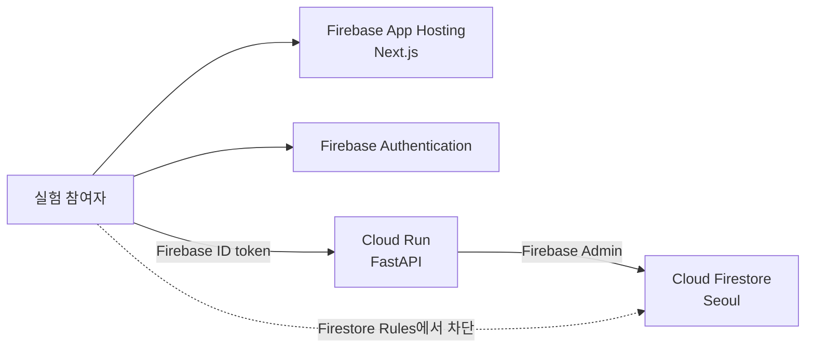

현재 EcoPlay에는 일반 **Firebase Hosting**이 아니라 다음 구성이 가장 적합합니다.

- 프론트엔드: **Firebase App Hosting**
- 백엔드: **Google Cloud Run**
- 인증: **Firebase Authentication**
- 데이터베이스: **Cloud Firestore**

App Hosting은 Next.js를 직접 지원하지만 Python/FastAPI는 실행하지 않으므로 Cloud Run을 함께 사용해야 합니다. 둘 다 기존 Firebase 프로젝트 `ecoplay-6fd53` 안에서 관리됩니다.

> 주의: Firebase Console의 **Hosting & Serverless → Hosting**이 아니라 **Hosting & Serverless → App Hosting**을 선택해야 합니다. 현재 questionnaire 페이지가 동적 서버 렌더링을 사용하므로 일반 정적 Hosting에는 그대로 배포할 수 없습니다.

## 전체 구조

````

````

## 0단계: 콘솔 작업 전에 코드를 배포 가능하게 준비

현재 코드를 바로 배포하면 안 됩니다. 다음 항목을 먼저 수정해야 합니다. 이 부분은 콘솔에서 하는 작업이 아니라 제가 코드에서 처리할 수 있는 부분입니다.

### 0-1. Firebase Admin 인증 방식 변경

현재 [firebase.py (line 12)](/Users/anselm/_DEV_/EcoPlay/backend/core/firebase.py:12)는 로컬의 `backend/secret/ecoplay.json`만 읽습니다.

Cloud Run에서는 JSON 키 파일을 업로드하지 않고 다음처럼 Google Cloud가 제공하는 자격증명을 사용해야 합니다.

```
firebase_admin.initialize_app()
```

로컬 개발에서는 기존 JSON 파일을 사용하고, Cloud Run에서는 Application Default Credentials를 사용하도록 분기해야 합니다.

### 0-2. Cloud Run 실행 설정 추가

Cloud Run은 애플리케이션이 `PORT` 환경 변수에 지정된 포트로 실행되길 기대합니다.

대략 다음 형태가 필요합니다.

```
uvicorn main:app --host 0.0.0.0 --port "$PORT"
```

이를 안정적으로 실행할 `Dockerfile`을 `backend/`에 추가하는 방법이 가장 확실합니다.

### 0-3. CORS 설정 변경

현재 [main.py (line 24)](/Users/anselm/_DEV_/EcoPlay/backend/main.py:24)는 localhost만 허용합니다.

```
allow_origins=[
    "http://localhost:3000",
    "http://localhost:9000",
]
```

이를 환경 변수로 관리하도록 변경해야 합니다.

```
CORS_ORIGINS=http://localhost:9000,https://배포주소.hosted.app
```

### 0-4. 프로덕션 인증 강제

Cloud Run에는 반드시 다음 환경 변수를 지정해야 합니다.

```
ENVIRONMENT=production
```

그리고 환경 변수를 빠뜨리더라도 인증 우회가 활성화되지 않도록 코드의 기본값도 `production`으로 변경해야 합니다.

### 0-5. 프론트엔드 API 주소 변경

현재 [api.ts (line 3)](/Users/anselm/_DEV_/EcoPlay/frontend/src/lib/api.ts:3)의 기본 주소는 다음과 같습니다.

```
http://localhost:8000
```

App Hosting에는 아래 환경 변수를 설정해야 합니다.

```
NEXT_PUBLIC_API_URL=https://Cloud-Run-주소
```

### 0-6. 배포 전 필수 품질 수정

외부 공개 전에 최소한 다음도 처리하는 것이 좋습니다.

- Next.js 보안 업데이트(현재 15.x 최신 patch인 15.5.23)
- 현재 TypeScript 오류 3개 수정
- `ignoreBuildErrors` 제거
- Firestore rules를 저장소에 추가
- 브라우저의 직접 Firestore 접근 코드 제거
- questionnaire/consent API의 participant ownership 검사
- 공개 회원가입을 제거하거나 임의의 연구 참여 코드로 교체

이 준비가 완료되고 GitHub `main` 브랜치에 push된 다음 콘솔 작업을 시작하는 편이 안전합니다.

코드 준비 상태는 저장소 루트에서 다음 명령으로 한 번에 검증할 수 있습니다.

```bash
./scripts/verify-deployment-readiness.sh
```

이 검사는 backend test/package build, frontend typecheck/lint/production build,
Cloud Run container build를 수행합니다. 로컬 production build에는
`frontend/.env.local`의 실제 Firebase Web App 값과 `NEXT_PUBLIC_API_URL`이 필요합니다.

------

# 1단계: Blaze 요금제로 변경

Firebase App Hosting과 Cloud Run을 사용하려면 결제 계정이 연결된 Blaze 요금제가 필요합니다.

1. [Firebase Console](https://console.firebase.google.com/)에 접속합니다.
2. 프로젝트 목록에서 `ecoplay-6fd53`을 선택합니다.
3. 화면 왼쪽 아래의 현재 요금제 표시를 찾습니다.
4. **Upgrade**를 클릭합니다.
5. **Blaze — Pay as you go**를 선택합니다.
6. 기존 Cloud Billing account가 없다면 새로 만듭니다.
7. 결제 카드를 등록합니다.
8. 업그레이드를 완료합니다.

App Hosting은 Blaze가 필수지만, 낮은 트래픽에서는 무료 사용량 범위 안에 머물 가능성이 높습니다. [Firebase App Hosting 비용 안내](https://firebase.google.com/docs/app-hosting/costs)

## 1-1. 예산 알림 설정

Blaze에는 자동 비용 상한이 없으므로 알림을 반드시 만들어 두는 것이 좋습니다.

1. [Google Cloud Console](https://console.cloud.google.com/)을 엽니다.
2. 상단 project selector에서 `ecoplay-6fd53`을 선택합니다.
3. 왼쪽 메뉴에서 **Billing**을 엽니다.
4. **Budgets & alerts**를 선택합니다.
5. **Create budget**을 클릭합니다.
6. 이름을 `EcoPlay monthly budget`으로 설정합니다.
7. **Projects**에서 `ecoplay-6fd53`만 선택합니다.
8. 월 예산은 처음에는 `$5` 또는 `$10`으로 설정합니다.
9. 알림 기준은 `50%`, `90%`, `100%`로 설정합니다.
10. 이메일 주소를 확인하고 저장합니다.

Budget alert는 알림만 전송하며 서비스를 자동으로 중단시키지는 않습니다. [Google Cloud 예산 알림 안내](https://docs.cloud.google.com/billing/docs/how-to/budgets)

------

# 2단계: Cloud Run용 Service Account 만들기

이 계정은 FastAPI가 Firestore에 접근할 때 사용합니다. 별도 JSON 키는 만들지 않습니다.

1. Google Cloud Console에서 `ecoplay-6fd53` 프로젝트를 선택합니다.
2. 왼쪽 메뉴에서 **IAM & Admin → Service Accounts**로 이동합니다.
3. **Create service account**를 클릭합니다.
4. 다음과 같이 입력합니다.

```
Service account name: EcoPlay API
Service account ID: ecoplay-api
```

1. **Create and continue**를 클릭합니다.
2. **Select a role**을 클릭합니다.
3. `Cloud Datastore User`를 검색하여 선택합니다.
4. **Continue**를 클릭합니다.
5. 마지막 사용자 권한 단계는 비워 두고 **Done**을 클릭합니다.
6. 생성된 이메일 주소를 확인합니다.

형식은 대략 다음과 같습니다.

```
ecoplay-api@ecoplay-6fd53.iam.gserviceaccount.com
```

**Keys → Add key**는 누르지 마세요. Cloud Run은 Service Account를 직접 연결하므로 JSON 키가 필요 없습니다. [Cloud Run Service Identity 안내](https://docs.cloud.google.com/run/docs/configuring/services/service-identity)

------

# 3단계: FastAPI를 Cloud Run에 배포

코드 준비가 끝난 뒤 진행합니다.

## 3-1. Google Cloud Shell 열기

1. Google Cloud Console 상단 오른쪽의 터미널 모양 아이콘 **Activate Cloud Shell**을 클릭합니다.
2. 화면 아래에 터미널이 열릴 때까지 기다립니다.
3. GitHub 저장소를 clone합니다.

예:

```
git clone <EcoPlay GitHub 저장소 주소>
cd EcoPlay/backend
```

## 3-2. Cloud Run 배포 명령 실행

```
gcloud run deploy ecoplay-api \
  --source . \
  --project ecoplay-6fd53 \
  --region asia-northeast3 \
  --allow-unauthenticated \
  --service-account ecoplay-api@ecoplay-6fd53.iam.gserviceaccount.com \
  --min-instances 0 \
  --max-instances 2 \
  --memory 512Mi \
  --set-env-vars ENVIRONMENT=production
```

질문이 표시되면:

- API 활성화 질문: `y`
- Artifact Registry 생성 질문: `y`
- Public access 질문: `y`

`--allow-unauthenticated`라고 되어 있지만 실험 API가 인증 없이 열리는 것은 아닙니다. Cloud Run 입구만 공개하고, 실제 API 요청은 FastAPI가 Firebase ID token으로 검사합니다. 브라우저가 Firebase token을 이용하려면 Cloud Run 자체는 public이어야 합니다. [Cloud Run public access 안내](https://docs.cloud.google.com/run/docs/authenticating/public)

빌드와 배포가 끝나면 다음과 비슷한 주소가 출력됩니다.

```
https://ecoplay-api-xxxxxxxxxx-an.a.run.app
```

이 주소를 복사해 둡니다.

## 3-3. 백엔드 확인

브라우저에서 다음 주소를 엽니다.

```
https://Cloud-Run-주소/health
```

정상이면 다음이 보여야 합니다.

```
{"status":"ok"}
```

오류가 나면:

1. Google Cloud Console로 이동합니다.
2. **Cloud Run → Services**를 엽니다.
3. `ecoplay-api`를 클릭합니다.
4. **Logs** 탭을 엽니다.
5. 가장 최근 오류를 확인합니다.

Cloud Run은 사용자가 없을 때 인스턴스를 0개로 줄입니다. 따라서 오랫동안 사용하지 않은 후 첫 요청은 몇 초 느릴 수 있지만, 낮은 트래픽의 1년짜리 실험에는 비용 면에서 적합합니다. [Cloud Run source deployment 안내](https://docs.cloud.google.com/run/docs/deploying-source-code)

------

# 4단계: Firebase App Hosting에 Next.js 배포

## 4-1. App Hosting 열기

1. Firebase Console에서 `ecoplay-6fd53`을 선택합니다.
2. 왼쪽 메뉴에서 **Hosting & Serverless → App Hosting**을 선택합니다.
3. **Get started**를 클릭합니다.

이미 backend가 하나 있다면 **Create backend**가 표시될 수 있습니다.

## 4-2. Region 선택

**Primary region**은 다음으로 선택합니다.

```
asia-east1 — Taiwan
```

현재 App Hosting은 Seoul region을 지원하지 않습니다. Taiwan이 한국과 가장 가깝습니다. 정적 자원은 CDN에서 제공되므로 실제 사용자 지연은 대체로 크지 않습니다. [App Hosting 지원 region](https://firebase.google.com/docs/app-hosting/get-started)

## 4-3. GitHub 연결

1. **Connect to GitHub**를 클릭합니다.
2. GitHub 로그인 화면이 나오면 로그인합니다.
3. **Firebase App Hosting GitHub App** 설치를 승인합니다.
4. Repository 접근 권한에서 EcoPlay 저장소를 선택합니다.
5. Firebase Console로 돌아옵니다.
6. EcoPlay repository를 선택합니다.

## 4-4. Monorepo 설정

EcoPlay는 frontend와 backend가 하나의 저장소에 들어 있으므로 다음처럼 설정합니다.

```
Root directory: /frontend
Live branch: main
Automatic rollouts: Enabled
```

Backend name은 다음처럼 설정하면 됩니다.

```
ecoplay-web
```

Runtime을 선택하는 화면이 있다면:

```
Node.js 22
```

Firebase Web App을 선택하라는 화면이 나오면 기존 EcoPlay Web App을 선택합니다. 기존 앱이 보이지 않으면 새 Web App을 만들 수 있지만, 이 경우 Firebase 환경 변수도 새 앱 값에 맞게 갱신해야 합니다.

마지막으로 **Finish and deploy**를 클릭합니다.

첫 배포는 약 5분 정도 걸릴 수 있습니다. 완료되면 다음과 같은 주소가 만들어집니다.

```
https://ecoplay-web--ecoplay-6fd53.asia-east1.hosted.app
```

App Hosting은 GitHub의 `main` 브랜치에 새 commit이 push될 때마다 자동 배포합니다. [Firebase App Hosting 시작 안내](https://firebase.google.com/docs/app-hosting/get-started)

------

# 5단계: App Hosting 환경 변수 설정

초기 배포가 실패했거나 Firebase/API 연결이 되지 않는다면 환경 변수가 없는 경우가 가장 많습니다.

1. Firebase Console에서 **Hosting & Serverless → App Hosting**으로 이동합니다.
2. `ecoplay-web`을 클릭합니다.
3. **Settings**를 클릭합니다.
4. **Environment**를 선택합니다.
5. **Add variable**을 클릭합니다.

다음 변수를 추가합니다.

```
NEXT_PUBLIC_FIREBASE_API_KEY
NEXT_PUBLIC_FIREBASE_AUTH_DOMAIN
NEXT_PUBLIC_FIREBASE_PROJECT_ID
NEXT_PUBLIC_FIREBASE_STORAGE_BUCKET
NEXT_PUBLIC_FIREBASE_MESSAGING_SENDER_ID
NEXT_PUBLIC_FIREBASE_APP_ID
NEXT_PUBLIC_FIREBASE_MEASUREMENT_ID
NEXT_PUBLIC_API_URL
```

Firebase 관련 값은 로컬 `frontend/.env.local`에서 복사합니다.

`NEXT_PUBLIC_API_URL`에는 3단계에서 받은 Cloud Run URL을 넣습니다.

```
NEXT_PUBLIC_API_URL=https://ecoplay-api-xxxxxxxxxx-an.a.run.app
```

`NEXT_PUBLIC_` 값은 브라우저에 공개되는 값입니다. Firebase Web API key도 Firebase 웹 앱에서는 원래 공개되는 식별 정보이므로 여기에 넣어도 됩니다. 서버용 Service Account JSON은 절대 넣으면 안 됩니다.

저장 후:

1. **Save**를 클릭합니다.
2. 새 rollout을 생성하라는 안내가 나오면 **Create rollout**을 선택합니다.
3. rollout이 완료될 때까지 기다립니다.

Console에서 설정한 환경 변수는 다음 rollout부터 적용됩니다. [App Hosting 환경 변수 안내](https://firebase.google.com/docs/app-hosting/configure)

------

# 6단계: Firebase Authentication에 배포 도메인 추가

1. Firebase Console에서 **Security → Authentication**으로 이동합니다.
2. **Settings** 탭을 선택합니다.
3. **Authorized domains** 섹션을 찾습니다.
4. **Add domain**을 클릭합니다.
5. App Hosting 주소에서 프로토콜과 경로를 제외한 도메인만 입력합니다.

예:

```
ecoplay-web--ecoplay-6fd53.asia-east1.hosted.app
```

다음처럼 입력하면 안 됩니다.

```
https://ecoplay-web--ecoplay-6fd53.asia-east1.hosted.app/
```

저장합니다.

로컬 개발을 계속한다면 `localhost`는 유지할 수 있습니다. 실제 실험 기간에는 필요하지 않다면 제거하는 것이 더 안전합니다. [Firebase Authentication authorized domains 안내](https://firebase.google.com/support/faq)

------

# 7단계: Cloud Run CORS에 App Hosting 주소 추가

코드가 환경 변수 기반 CORS를 지원하도록 준비된 후 진행합니다.

1. Google Cloud Console에서 **Cloud Run → Services**로 이동합니다.
2. `ecoplay-api`를 클릭합니다.
3. **Edit and deploy new revision**을 클릭합니다.
4. **Containers, Networking, Security**를 엽니다.
5. Container 설정에서 **Variables & Secrets**를 찾습니다.
6. 다음 환경 변수를 추가합니다.

```
CORS_ORIGINS=https://App-Hosting-주소
```

예:

```
CORS_ORIGINS=https://ecoplay-web--ecoplay-6fd53.asia-east1.hosted.app
```

1. **Deploy**를 클릭합니다.

같은 설정으로 backend를 다시 배포하려면 저장소 루트에서 다음 스크립트를 사용할 수 있습니다.

```bash
CORS_ORIGINS=https://ecoplay-web--ecoplay-6fd53.asia-east1.hosted.app \
  ./scripts/deploy-cloud-run.sh
```

## 7-1. Firestore Security Rules 배포

저장소의 `firestore.rules`는 browser의 직접 read/write를 모두 차단합니다. 이 파일을
추가하는 것만으로 live project에 적용되지는 않으므로 Firebase CLI로 명시적으로
배포해야 합니다.

```bash
firebase login
./scripts/deploy-firestore-rules.sh
```

배포 대상은 `.firebaserc`와 script 모두에서 `ecoplay-6fd53`으로 고정되어 있습니다.
Firebase Admin SDK를 사용하는 Cloud Run backend는 IAM으로 접근하므로 이 deny-all
rule의 영향을 받지 않습니다.

------

# 8단계: 전체 실험 흐름 확인

App Hosting URL을 Chrome Incognito window에서 엽니다.

다음 순서로 확인합니다.

1. 로그인
2. 동의서 제출
3. demographic questionnaire 제출
4. Public Goods Game session 시작
5. trial 하나 제출
6. RTG tutorial 실행
7. report 페이지 열기
8. Firestore Console에서 문서가 생성됐는지 확인

브라우저 개발자 도구에서:

1. `F12` 또는 **View → Developer → Developer Tools**
2. **Network** 탭
3. 빨간 요청이 있는지 확인

정상적인 API 응답:

```
200 OK
201 Created
```

문제별 의미:

- `401`: Firebase token 또는 로그인 문제
- `403`: Cloud Run public access 또는 backend ownership 문제
- `422`: frontend/backend 요청 형식 불일치
- CORS error: Cloud Run의 `CORS_ORIGINS` 문제
- `permission-denied`: 브라우저가 Firestore에 직접 접근하려는 코드가 남아 있음
- `500`: Cloud Run의 **Logs** 확인 필요

Firestore Rules가 deny-all인 상태에서 FastAPI를 통한 저장은 계속 성공해야 합니다.

------

# 9단계: 비용 제한과 운영 확인

## Cloud Run 설정

Google Cloud Console에서:

1. **Cloud Run → Services → ecoplay-api**
2. **Edit and deploy new revision**
3. **Scaling**을 확인합니다.

권장값:

```
Minimum instances: 0
Maximum instances: 2
```

참여자가 접속하지 않을 때 비용을 최소화할 수 있습니다.

## App Hosting 설정

`frontend/apphosting.yaml`에 다음처럼 제한할 수 있습니다.

```
runConfig:
  minInstances: 0
  maxInstances: 2
  concurrency: 40
  cpu: 1
  memoryMiB: 512
```

낮은 트래픽에서는 충분합니다.

## 모니터링 위치

- 프론트 배포: **Firebase Console → App Hosting → Rollouts**
- 프론트 로그: **App Hosting → Logs**
- 백엔드 로그: **Google Cloud Console → Cloud Run → ecoplay-api → Logs**
- Firestore 사용량: **Firebase Console → Firestore Database → Usage**
- 전체 비용: **Google Cloud Console → Billing → Reports**
- 예산 알림: **Billing → Budgets & alerts**

------

# 10단계: Custom Domain은 나중에 선택

초기에는 `hosted.app` 주소로 실험을 진행해도 됩니다. HTTPS 인증서는 자동입니다.

별도 도메인을 원한다면:

1. Firebase Console에서 **App Hosting → ecoplay-web**
2. **Settings → Domains**
3. **Add custom domain**
4. 소유한 도메인을 입력합니다.
5. Firebase가 안내하는 DNS record를 도메인 업체에 등록합니다.
6. 인증과 SSL 발급을 기다립니다.

처음 배포할 때는 custom domain 없이 기본 주소로 전체 실험을 검증하는 것이 좋습니다.

## 현실적인 다음 순서

지금 바로 Firebase Console에서 App Hosting을 만들기보다는 다음 순서가 안전합니다.

1. 제가 EcoPlay 코드를 Cloud Run/App Hosting 배포 가능 상태로 수정
2. 로컬 테스트와 production build 확인
3. GitHub에 push
4. Blaze 및 Budget alert 설정
5. Cloud Run 배포
6. App Hosting 배포
7. Authentication domain과 CORS 설정
8. 테스트 참여자 한 명으로 전체 실험 검증

배포 준비 코드와 자동 검증은 완료되었습니다. 다음 작업은 변경사항을 commit/push한 뒤
1단계의 Blaze/Budget 설정부터 순서대로 진행하는 것입니다.
